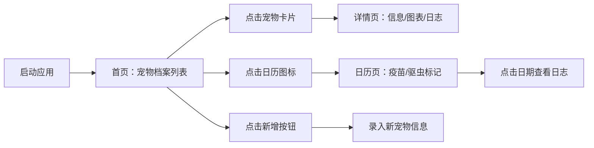

## 1. 产品概述

宠物健康记录小工具，专为养猫狗的宠物主人设计，帮助用户系统化记录和管理宠物的健康信息。

- 解决问题：宠物疫苗、驱虫、体检、洗澡等健康事件容易遗忘，缺乏统一记录和提醒工具
- 目标用户：养猫养狗的宠物主人
- 产品价值：让宠物健康管理变得简单直观，数据一目了然

## 2. 核心功能

### 2.1 用户角色

| 角色 | 注册方式 | 核心权限 |
|------|----------|----------|
| 普通用户 | 无需注册，本地存储 | 增删改查宠物档案、健康日志，查看日历提醒 |

### 2.2 功能模块

1. **首页（宠物档案列表）**：卡片式展示所有宠物，显示头像、名字、年龄、最近体检日期，支持新增宠物
2. **详情页**：展示宠物品种、体重、疫苗记录，半年体重变化折线图，按时间倒序展示驱虫、洗澡、就医等健康日志
3. **日历页**：日历视图，圆点标记疫苗和驱虫日，点击日期查看当天日志详情

### 2.3 页面详情

| 页面名称 | 模块名称 | 功能描述 |
|----------|----------|----------|
| 首页 | 导航栏 | 应用标题、页面切换（列表/日历） |
| 首页 | 宠物卡片列表 | 卡片式布局，显示头像、名字、年龄、最近体检日期 |
| 首页 | 新增按钮 | 右上角橙色按钮，弹窗录入新宠物信息 |
| 详情页 | 宠物信息区 | 头像、名字、品种、年龄、当前体重 |
| 详情页 | 体重折线图 | ECharts 展示近半年体重变化趋势 |
| 详情页 | 疫苗记录 | 表格展示已接种疫苗及日期 |
| 详情页 | 健康日志列表 | 按时间倒序展示驱虫、洗澡、就医等事件，支持新增/删除 |
| 日历页 | 月历视图 | 当月日历，圆点标记有提醒的日期 |
| 日历页 | 日期详情弹层 | 点击日期展示当天的所有健康日志 |

## 3. 核心流程

用户打开应用 → 查看宠物档案列表 → 点击某只宠物 → 查看该宠物详情、体重趋势、健康日志 → 切换到日历视图查看本月疫苗/驱虫提醒 → 点击具体日期查看当天日志

## 4. 用户界面设计

### 4.1 设计风格

- 主色调：浅米色（#FFF8F0）背景，橙色（#FF8C42）点缀
- 辅助色：柔和绿色（#68B684）表示健康状态，淡蓝色（#7FB3D5）表示疫苗
- 按钮风格：圆角按钮，橙色主按钮带轻微阴影
- 字体：系统无衬线字体，标题中等字重，正文轻盈
- 布局风格：卡片式布局，充足留白，圆角柔和阴影
- 图标风格：线性图标，简洁圆润

### 4.2 页面设计概览

| 页面名称 | 模块名称 | UI 元素 |
|----------|----------|----------|
| 首页 | 卡片列表 | 浅米色背景、白色卡片、圆角16px、柔和阴影、橙色头像边框 |
| 详情页 | 体重图表 | 橙色渐变折线、圆点标记、简洁网格 |
| 详情页 | 日志列表 | 时间线布局、事件图标、标签色区分类型 |
| 日历页 | 月历 | 淡色网格、选中日期橙色背景、圆点标记在日期下方 |

### 4.3 响应式

桌面端优先布局，移动端自适应卡片宽度和日历尺寸，保持触摸友好的点击区域。
