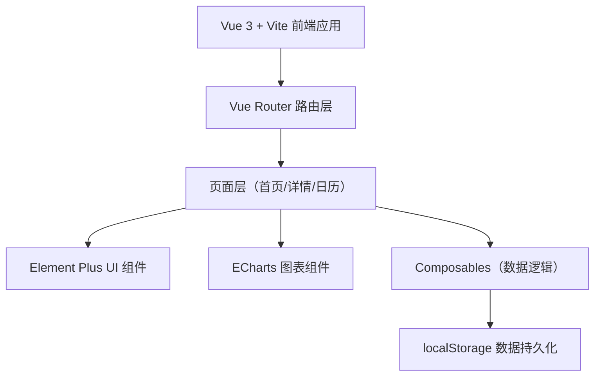
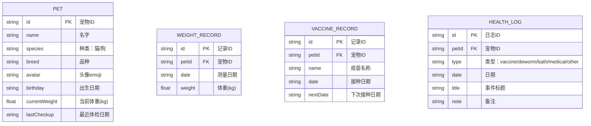

## 1. 架构设计



## 2. 技术说明

- 前端框架：Vue 3 + TypeScript + Vite
- UI 组件库：Element Plus
- 图表库：ECharts 5
- 路由：Vue Router 4
- 样式方案：Tailwind CSS 3
- 数据存储：浏览器 localStorage（无后端）
- 初始化工具：vite-init

## 3. 路由定义

| 路由 | 页面组件 | 用途 |
|------|----------|------|
| / | PetList.vue | 首页：宠物档案列表 |
| /pet/:id | PetDetail.vue | 详情页：宠物信息、体重图表、健康日志 |
| /calendar | Calendar.vue | 日历页：疫苗/驱虫提醒日历 |

## 4. 数据模型

### 4.1 数据模型定义



### 4.2 localStorage 键设计

- `pet-health-pets`: 宠物档案数组
- `pet-health-weights`: 体重记录数组
- `pet-health-vaccines`: 疫苗记录数组
- `pet-health-logs`: 健康日志数组

## 5. 项目目录结构

```
src/
├── components/          # 可复用组件
│   ├── PetCard.vue      # 宠物卡片
│   ├── WeightChart.vue  # 体重折线图
│   └── HealthTimeline.vue # 健康日志时间线
├── composables/         # 组合式函数
│   ├── usePetStore.ts   # 宠物数据管理
│   └── useCalendar.ts   # 日历逻辑
├── pages/               # 页面组件
│   ├── PetList.vue      # 首页列表
│   ├── PetDetail.vue    # 宠物详情
│   └── CalendarView.vue # 日历视图
├── types/               # TypeScript 类型
│   └── index.ts
├── utils/               # 工具函数
│   ├── storage.ts       # localStorage 封装
│   └── mock.ts          # Mock 初始数据
├── router/
│   └── index.ts
├── App.vue
└── main.ts
```
